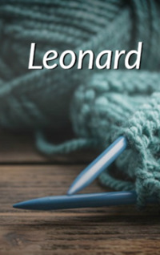

# Leonard <kbd>v3.2.1</kbd>

  

## Creator
Adrienne M. Frater

## Description
Women often knit clothes. It can be either a thing for herself or a gift for children or grandchildren. Grandmothers often knit clothes for babies to help their children. Women can knit scarves or socks for husbands. Buying a gift in a store is much easier and faster, but when you do it yourself, the value of this gift increases. Leonard's wife knits independently, although it is hard for her to do it. Health leaves the woman. Her arms aches and moves badly, but she goes on knitting. Arthritis has long prevented her from living. But this woman knits a scarf for her husband. She knits a scarf of the same color as his eyes. The woman waits for her niece, who will arrive to take her to the store. She wants to make purchases and buy more wool for the scarf. She needs blue soft and cuddly wool.
