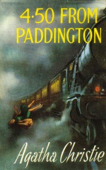

# 4:50 from Paddington <kbd>v3.3.1</kbd>

  

## Creator
Agatha Christie

## Description

Miss Marple is a fragile and a kind woman with a very sharp mind. When her friend Mrs Elspeth McGillicuddy came to her and told her a terrifying story, they had to call the police. Elspeth was travelling by train and when she suddenly woke up at midnight, she unexpectedly saw a horrible scene – a man was strangling a woman in the train that was passing by. Witnesses started to call for help, but a conductor didn't believe her and just thought that crazy woman had a nightmare. Nobody really believed in this story at the police either, because there are weren't any reports about a the crime at the train. As soon as Mrs McGillicuddy finished her story, Miss Marple had already had some ideas about this crime. And while Elspeth was still crying and complaining that nobody believed her, Miss Marple was already considering how the criminal got rid of the corpse. 

