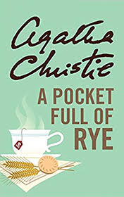

# A Pocket Full of Rye <kbd>v3.3.1</kbd>

  

## Creator
Agatha Christie

## Description
A businessman dies while having a cup of traditional morning tea in his office. The results of the medical examination clearly indicate that he had been poisoned. Such kind of poison does not work right away, so according to the time of death the victim was poisoned at home during breakfast. The police found some rye grains in his pockets. The relatives did not love the businessman, so his death was beneficial to almost every member of this large family. The first suspect is his young wife. She is the main heiress of the fortune. The elder son recently quarreled with his father. His daughter-in-law could not stand him. The late businessman forbade his daughter to marry. And all at once, the youngest son arrives. Long time ago he broke the relationship with the father and lived in Africa with his wife. The youngest son says his father sent an unexpected letter with the intention of making peace.
