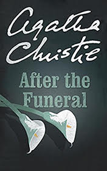

# After the Funeral <kbd>v3.2.1</kbd>

  

## Creator
Agatha Christie

## Description
'After the funeral' is a book written by the legendary British author Agatha Christie. It is a classical detective novel full of suspense and plot twists. As usual, A. Christie demonstrates great attention to details and knowledge of human psychology. The book is intriguing from the very beginning. A wealthy old man Richard Abernethie dies after a long illness. After the funeral his numerous relatives gather to hear the will. Suddenly Richard's sister Cora shocks everyone suggesting that he didn't die a natural death. However, nobody takes her words seriously until the woman herself is found murdered. The famous Belgian detective Hercule Poirot is ready to investigate this unusual story. But the case is not easy as mysterious events keep happening and everyone around is a suspect.
