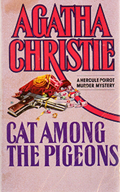

# Cat Among the Pigeons <kbd>v3.2.1</kbd>

  

## Creator
Agatha Christie

## Description

A sophisticated detective Poirot has to solve another tangled case. One evening he had an unexpected guest. A schoolgirl Julia Upjohn told about series of awful crimes at her school 'Meadowbank' – from kidnapping to murders. Such series of crimes couldn't be solved sitting on a chair, so Hercule rushed to mentioned school immediately. The investigation followed to the begging of the first offenses that started during revolution in the Palace of Ramat two months ago. Prince of Ramat and his private pilot were surrounded by rebels and were close to death. The only thing Prince wanted to save from Palace was a leather pouch full of jewels of value more than million pounds. In desperation Price gave such precious pouch to his pilot and asked him to get it out of the country. The confused pilot had found best solution was to hide treasure in his sister and daughter's own baggage.

