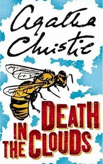

# Death in the Clouds <kbd>v3.3.1</kbd>

  

## Creator
Agatha Christie

## Description
The author of this novel does not only bring Poirot aboard the plane but also makes him be in a new role of a murder suspect. One elderly Frenchwoman Madame Giselle is found dead for some time before getting on the plane. The murder is daring as there were 10 passengers, but nobody saw how it happened. The case is shameless because somebody put the direct evidence to none other than Hercule Poirot! He cannot stand such unprecedented impudence. So, we have 12 suspects: a well-known archeologist and his son-archeologist, two stewards, an aristocrat, a countess, a former actress, an assistant of one London hairdresser, a popular dentist, an ENT doctor, a head of one large company, a famous author of detective stories and Hercule Poirot himself. Do you have any ideas, which one of these people is the murderer?
