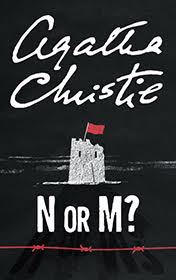

# N or M? <kbd>v3.2.1</kbd>

  

## Creator
Agatha Christie

## Description
Agatha Christie managed to create bright detective characters. In the center of the novel 'N or M', there are the Beresfords as the most mature images from the artistic point of view. The reader could meet them in the previous novels 'The Secret Adversary' and 'Partners in Crime'. The actions take place in the 1940s. In their youth, the Beresfords used to rest on the deserved laurels as smart detectives. Now they are tired of inactivity and uselessness. Suddenly Tommy gets a great opportunity to uncover the Nazi agents' atrocities who arranged the murder of Farquhar. Tommy is to take his place in the department. The last words of Farquhar 'N or M. Song Susie' are all to start with. Everything has to be a secret for Tuppence but she learns about this new case and follows her husband. So, they begin to act together again.
