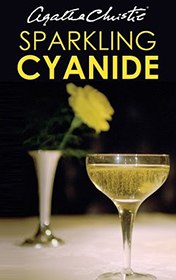

# Sparkling Cyanide <kbd>v3.3.1</kbd>

  

## Creator
Agatha Christie

## Description

This is an exciting detective story about love and passion, betrayal and treason, greed and egoism. The dynamic of the book, its lively and imaginative language attract invariably. The Iris Marle’s sister Rosemary committed suicide after a nasty illness and long depression. Rosemary was older than her sister six years. She was always beautiful, funny and clever. Iris was always jealous for her because of Rosemary’s perfect life. Rosemary’s life was like a dream until she married George Barton. They looked absolutely different. Rosemary was shiny, sociable, outgoing, with big heritage from godfather. But George was quiet, introverted and not very rich man… According to such difference, was it really suicide?

