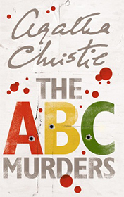

# The Abc Murders <kbd>v3.2.1</kbd>

  

## Creator
Agatha Christie

## Description
This story is told by faithful friend of Hercule Poirot. Old friends used to work together solving crimes, haven't seen each other for years. Captain Arthur Hastings has married and left for South Africa. Poirot himself already retired and worked as private detective. Hastings was passing through London and decided to visit an old friend at his new apartments. Capitan had noticed that Poirot had not changed a lot тАУ famous detective still wit, his mustache still big and beautiful, and he still helps police with their investigations. During the meeting of former colleagues Poirot received a letter from a criminal who challenged him. Author signed as someone mysteries 'ABC' and proposed to solve a crime that will be committed in future. So again Poirot and his partner would work together solving a complicated case.
