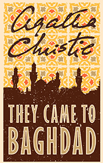

# They Came to Baghdad <kbd>v3.3.1</kbd>

  

## Creator
Agatha Christie

## Description

Lady Agatha Christie knows East very well. She worked as an archaeologist when she and her husband were in Baghdad. This experience she used to write this book. The novel belongs to the spy fiction genre, which also contains politics, criminal and a love story. The main character is Victoria Jones. She lives in London and works as a typist in the office. She isn’t very successful at her work. Victoria lost the job. She is a very good actress with a rich fantasy and perfect transformation skills. Her imagination and an unexpected affair led her to Iraq, where many adventures are waiting for her. Some events are to happen in Baghdad. They will change the course of the history. The future of the whole world will be in the hands of the young girl.

