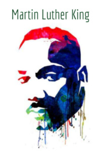

# Martin Luther King <kbd>v3.3.1</kbd>

  

## Creator
Alan C. Mclean

## Description
Martin Luther King is known worldwide as an uncompromising fighter for human rights. He was the first African-American politician of such magnitude. He was a religious preacher, as well as a real romantic and a dreamer until the last day of his life. At the age of fifteen, Martin got a convincing victory in the competition of speakers. Young Martin studied in Boston and received a PHD in theology. In the fifties he joined a large organization that was engaged in protecting the rights of citizens. Martin Luther King headed it for the rest of his life. This man never resorted to violence: he protested exclusively peacefully. There was not a single case where followers of Luther King were observed in the riots. Like their leader, the followers were humanists. 
