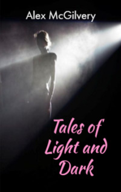

# Tales of Light and Dark <kbd>v3.3.1</kbd>

  

## Creator
Alex McGilvery

## Description
Everybody used to read fairy tales in childhood. They are the only suitable books for kids. Such popular characters as Snow White, Cinderella or the Frog Prince are familiar to everyone. Every child knows their life stories. But this book will help to change the firm belief about these fabulous characters. What if the Frog Prince is really an ordinary frog? What will happen if Cinderella forgets about the Godmother's instructions and stays in the royal castle after midnight? Snow White lives in a dark forest with seven dwarfs. They are not those cute gnomes with colored caps, but completely different creatures. Immerse yourself into the world of children's fairy tales, but look at them from a completely different perspective. This fascinating journey will not leave anyone indifferent.
