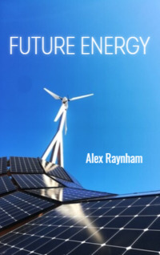

# Future Energy <kbd>v3.2.1</kbd>

  

## Creator
Alex Raynham

## Description
Many kilometres of gas pipes run across the planet. The whole world buys and sells oil and coal. Most of the mechanisms in the modern world work on this fuel. Huge ships loaded with these important resources travel from continent to continent every day. The whole world needs fuel. It needs energy for life. The  work of many factories and the creation of things depend on it. But time passes. The resources of our planet are limited. Sooner or later, the day will come when coal and oil are gone. Scientists are working to find reliable alternative energy resources. There is already a lot of research. We can get energy in unexpected places. Such future is near and this book will allow you to look into it today. 
