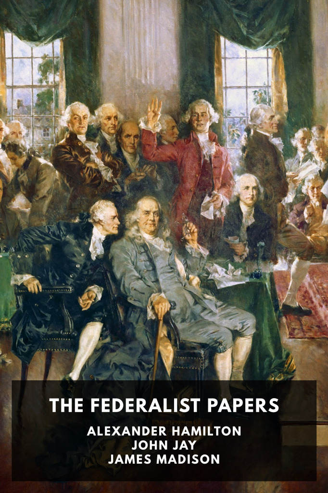

# The Federalist Papers <kbd>v3.3.1</kbd>

  

## Creator
Alexander Hamilton

## Description
Eighty-five articles written by a group of U.S. Founding Fathers on why the proposed U.S. Constitution should be approved.
