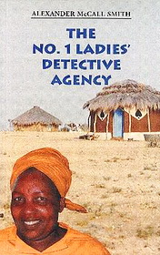

# The No1 Ladies Detective Agency <kbd>v3.3.1</kbd>

  

## Creator
Alexander Smith

## Description

Mma Ramotswe was born in a small African village Mochudi. When she was a child, her mother died in an accident, so she was brought up her father and cousin. The cousin loved Mma Ramotswe very much and since childhood she tried to teach her everything she knew herself. Therefore, at an early age Mma Ramotswe had learned to count, write, as well as to train memory and attention. Just because of her cousin a little girl went to church every Sunday and quickly realized the difference between good and bad. She finished school and became the best student, so Mma Ramotswe left her home and went to live with her cousin. There she has got her first job and even getting married. But her husband turned out a geek who beat her and eventually had escaped. So when her father left her a small inheritance she decided to start a detective agency, which will punish scoundrels like her husband.

