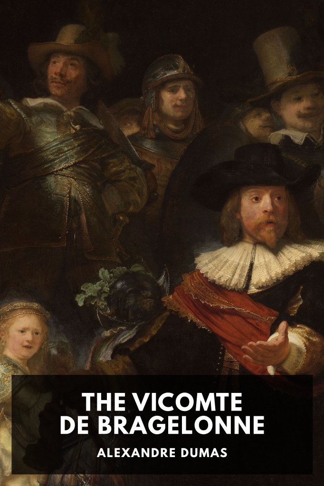

# The Vicomte de Bragelonne <kbd>v3.3.1</kbd>

  

## Creator
Alexandre Dumas

## Description
The events of the early days of Louis XIV’s majority reign in France, including the continuing story of the four musketeers who served both Louis XIV’s father and himself.
