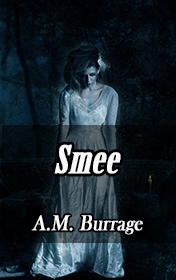

# Smee <kbd>v3.3.1</kbd>

  

## Creator
Alfred Burrage

## Description
This is a short story in the genre of horror, which tells the readers about one sinister and mysterious game. Fourteen friends gather in a big house on Christmas Eve. Someone suggests playing hide and seek, but one of the boys categorically refuses. He says that he will never play hide-and-seek again, because he saw the death of a young girl during this game. He offers the others one interesting entertainment. Smee is a game for such large companies. Someone gets a piece of paper with the inscription 'Smee', but no one knows who it is. Then the members of the game start going from room to room and trying to find this mysterious conspirator. But sometimes it happens so that someone mysterious and sinister joins the game.
