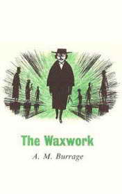

# The Waxwork <kbd>v3.3.1</kbd>

  

## Creator
Alfred Burrage

## Description

There are many things people are ready to do when they need money. A modest journalist is forced to apply to the head of Marriner's Waxworks and ask to let him spend a night in this museum. There is a Murderers' Room. Many waxworks of the most terrific maniacs in the world are gathered there. It is terrifying to spend some time along in this room. A brave man, who agrees to spend a night in the museum, will get a fee. The journalist is going to do this. He also promises the head to write the article about Marriner's Waxworks into the famous newspaper. It will be a good advertising for attracting the visitors. The deal is easy. Now the journalist has to stay at night in the museum. The most terrible thing is the waxwork of one French maniac. He hypnotized his victims before to wrest their throats. The maniac is said to have died, but his body isn't found yet.

