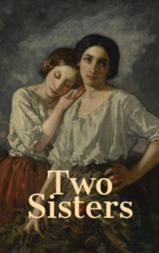

# Two Sisters <kbd>v3.2.1</kbd>

  

## Creator
Ama Ata Aidoo

## Description
Life doesn't seem very happy for a typist in a big office. And if the earnings are very small, then this is a real problem. The main character of this book cannot even buy a pair of new high-quality shoes. But every girl needs beautiful shoes. Besides that, she needs a beautiful and rich man with a fast and powerful car. He should also have a wallet, full of money. Mercy manages to find a boyfriend who meets all these requirements. But her sister, intelligent and sensible Connie, does not approve her decision. Older sister is long married and clearly understands life. At the end of the day, Mercy puts her typewriter in the bag and goes home. She thinks about her sister - the girl is confident that Connie does not understand anything and is just jealous of her.
