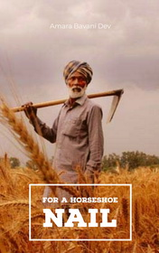

# For a Horseshoe Nail <kbd>v3.2.1</kbd>

  

## Creator
Amara Bavani Dev

## Description
Because of the nail the boot was damaged. Without a boot, it was not possible to ride. Without a horse, the rider could not arrive on time. And without the rider all the battle was lost. This is a story about a poor Indian farmer named Raju, who has to work hard for pennies. Fifty rupees a day is his limit. But once, one man offers him to sell a kidney for thirty five thousand rupees. This is a lot of money. The Indian poor can't earn such an incredible sum in his whole life. He decides to make this operation. Now Raju can buy pink and green halva and a bouquet of flowers for his beloved woman. He can buy whiskey for a blind old woman who loves to drink a shot before going to bed. The life of a poor farmer has changed for the better. After all, people live with one kidney. The main thing is do not pay attention to the pain.
