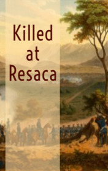

# Killed at Resaca <kbd>v3.3.1</kbd>

  

## Creator
Ambrose Bierce

## Description
Lieutenant Hermann Braille from Ohio was the best soldier in the regiment. No one knew him too closely, but the general treated Herman very well. Lieutenant Braille was a tall and handsome man. He had blue eyes and long blond hair. He always looked like a real gentleman. Even in battles he managed to wear a clean and tidy uniform. Herman was about thirty years old. He looked like a hero, which artists like painting on their pictures. In another battle, Hermann was just standing on the spot. The bullets and the shells were flying past. He did not make any movements, but nothing hurt him. After this incident, the other soldiers decided that the lieutenant was neither stupid nor immortal, but just a really very lucky man.
