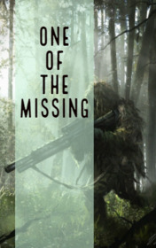

# One of the Missing <kbd>v3.3.1</kbd>

  

## Creator
Ambrose Bierce

## Description
Jerome was a scout for the Yankees. He often went to spy on the enemy soldiers. Once a group of officers housed on the hill. They were a blue Yankee uniform. The Confederation army moved farther to the other side of the forest. One of the officers asked about the enemy's actions: whether they were moving forward or retreating. They decided to send a scout to check it out. A few minutes later, Jerome set to work. Jerome was a very brave man and always worked alone. His hearing and sight were very keen. He heard what other people could not hear. The scout was walking through the forest with a heavy rifle. Jerome knew how to shoot very accurately. Reaching the edge of the forest, he disappeared in the shadows and started observing.
