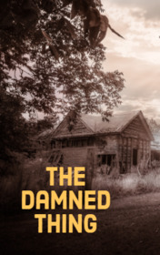

# The Damned Thing <kbd>v3.3.1</kbd>

  

## Creator
Ambrose Bierce

## Description
It was a deep night. Eight people gathered in a small house. They were sitting around a simple wooden table. One man was reading a book under the light of an old desk lamp. There was also the ninth person - the owner of the house. He was laying under a white rag dead. It was quiet in the house. Only the birds were shouting outside the window. The men gathered in the house had an important job. They had to understand how the owner of the house died. It was up to them to reveal the truth. They were farmers with tanned faces and strong muscles from the work in the field. The man with the book was different from them. With a hat and a mustache, he looked like an important educated person. The coroner was reading a diary that belonged to the dead man.
