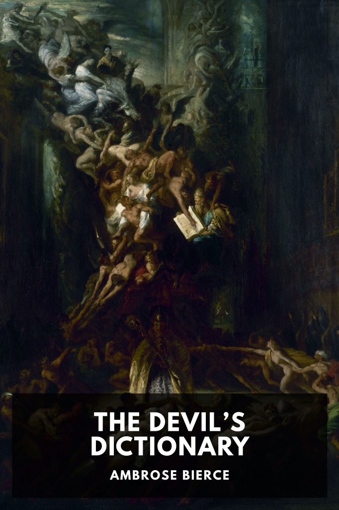

# The Devil’s Dictionary <kbd>v3.3.1</kbd>

  

## Creator
Ambrose Bierce

## Description
A witty, sharp collection of sardonic word definitions from the 1800s and early 1900s that provide a snapshot into the irreverent humor of early American culture.
