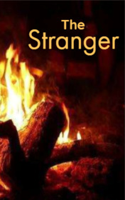

# The Stranger <kbd>v3.3.1</kbd>

  

## Creator
Ambrose Bierce

## Description
It was a dark cold night and the main characters were sitting around a fire in Arizona. Only snakes and birds were found in this dry and deserted rolling hills. No other people were visible, and the darkness outside the camp looked like a black wall. But all of a sudden a stranger appear near the fire. He calmly walked over and sat next to the others. The travellers raised their weapons, but the stranger was not afraid at all. He said that people had come to this desert before to explore it. He named the names of those four people who were able to pass this desert without a map. This man looked a little crazy. Perhaps he was lost, he had traveled for a long time alone and was happy to talk to other people. Or everything was not so simple.
