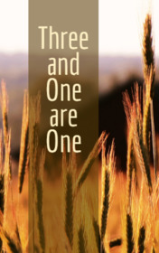

# Three and One Are One <kbd>v3.2.1</kbd>

  

## Creator
Ambrose Bierce

## Description
The main character of this story is a young man named Barr Lassiter. He lived near Carthage with his parents and older sister. The Lassiters were simple farmers. They were not wealthy enough to own a huge house or buy slaves. But they were never hungry. There was always enough food. Barr was twenty-two years old when the Civil War began. This event divided many families. Many children started opposing their parents. The people of the North did not support slavery, and the Southerners wanted to preserve the existing order of things at any cost. The Barr's family supported the Confederates. The young man was against it. In the end Barr was forced to leave home. The family did not try to stop him and did not even say goodbye.
