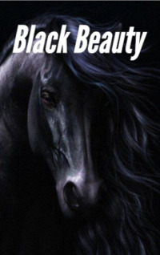

# Black Beauty <kbd>v3.2.1</kbd>

  

## Creator
Anna Sewell

## Description
This is one of the novels where the story is told not about a man, but about an animal. Even more unusual is that the story of the horse is in the first-person narrative. This horse lived in England in the middle of the nineteenth century. His name was Black Handsome - a beautiful and strong stallion with a white spot on his forehead. He faithfully served the people, was reliable and never betrayed. He had an interesting life, full of pleasant and hard moments. This book will help the reader to understand horses better and treat these animals with great respect. The story of Black Beauty will not leave the reader indifferent. This is not a trivial moralism, but a truly touching story. More than fifty million copies of this book have been sold in the world.
