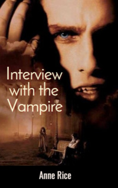

# Interview with the Vampire <kbd>v3.3.1</kbd>

  

## Creator
Anne Rice

## Description
The protagonist of this novel is Louis who is the owner of large plantations. He is only twenty-five years old. But he suffers serious depression. His brother committed suicide and Louis blames himself. He even wants to follow his brother but lacks determination for such an act. So the man is trying to get into troubles. He often visits taverns and other dangerous places. He constantly gets drunk and starts scandals. Louis has been looking for death for a very long time. Once he finds it. He meets a vampire named Lestat. Lestat also turns Louis into a vampire. He starts revealing to him the secrets of vampire life and even moves to a huge mansion of Louis. Lestat kills people without hesitation. Louis cannot get used to this so he drinks animal blood. But changes are to happen to him soon. 
