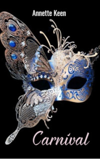

# Carnival <kbd>v3.3.1</kbd>

  

## Creator
Annette Keen

## Description
Jake arrives in London. It is just the beginning of a holiday weekend. This is the first time the eighteen-year-old guy has been so far from his native Manchester. Jake is very excited. The family stays at home while he is making such an interesting trip of his own. The guy opens the map and thinks where it is better to go first. The choice is the Notting Hill Carnival. Jake gets on a big red bus full of people. There is a large family with many children behind him. The children are making noise and talking about the Notting Hill Carnival. Jake realizes that they are going to the same place. Soon the guy gets to the carnival he has dreamed of for so long. His first trip turns out to be interesting and full of pleasant surprises. 
