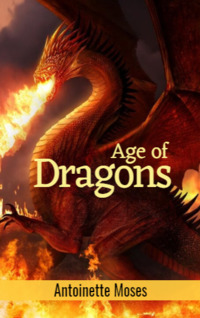

# Age of Dragons <kbd>v3.2.1</kbd>

  

## Creator
Antoinette Moses

## Description
This world is not at all like the one you are used to. Lots of amazing creatures live here: huge insects with intelligence, magnificent dragons and other monsters. All these creatures have a mind, a bad temper and their own view of the world around them. They are trying to decide how everyone else should live. The book begins with a story about the main character. The young man feels tired, because the day was very long. But it is not too important, because he is looking at the amazing subject and forgets about everything else. In his hands there is an arrow of skillful work. He saw many arrows and weapons in his life, but this one is truly beautiful. His father is a Khan and has always had many good weapons in his house. This book will tell about the adventures of a young guy who is to face exciting adventures. 
