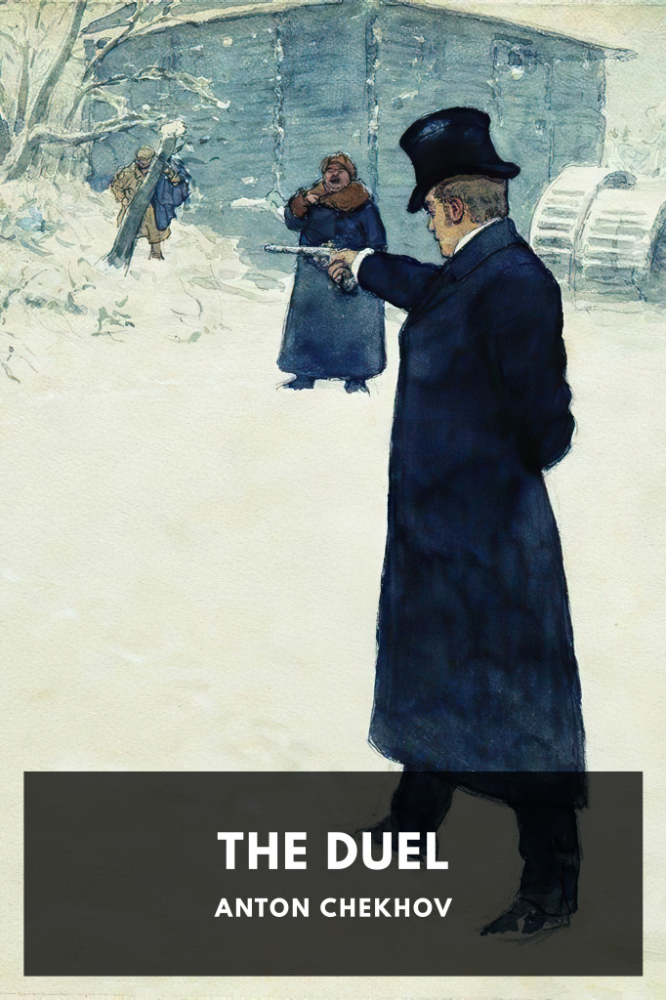

# The Duel <kbd>v3.2.1</kbd>

  

## Creator
Anton Chekhov

## Description
Von Koren, an educated zoologist, finds the slovenly lifestyle of Laevsky, a drinker, to be worthless. Finally, Laevsky can’t take it any more.
