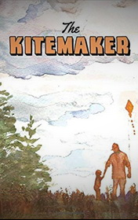

# The Kite-maker <kbd>v3.3.1</kbd>

  

## Creator
Anu Kumar

## Description
It's hard to hope or dream when there is a war on. There is no hope that tomorrow will come. Clare West has brought one life story from India. 'The Kite-Marker' is about one married couple Ahmed Rasool and Zaheera. They love and always support each other. The husband decides to distract from heavy thoughts about war which tormented him day by day and participate in the Utraan festival. Rasool wants to make a kite for the festival although his wife convinces him it's not a good time for a holiday. Indeed, there is grief in their house. But when the kite is made, Zaheera changes her mind and helps her husband. As the family doesn't lose courage, the destiny presents them the greatest gift. Clare West has managed to answer the main question in the small story - what is the most important thing in life? This story shows that when love and hope live in the family, nothing will destroy it - neither war, nor hunger, nor fear тАж
