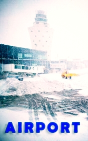

# Airport <kbd>v3.3.1</kbd>

  

## Creator
Arthur Hailey

## Description

The story of this novel happened in January 1967 on Friday in the evening from 18.30 till 1.30 at the Lincoln International Airport in Chicago. The snowstorm is over the Western states three days. All aerodromes services are working hard. About two tens planes aren’t taking off in time. Much load and perishables too are gathered at the storehouses. The runway hasn’t work. The plane has stuck in the melted ground. The airport’s building is chaos; thousands of passengers are waiting for a departure. The flights are late, some are canceled. The explosion has thundered on board the plane. Urgent landing is needed to be done… but it’s almost impossible.

