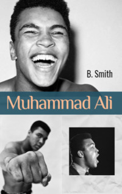

# Muhammad Ali <kbd>v3.3.1</kbd>

  

## Creator
B. Smith

## Description
Muhammad Ali. Everyone has heard this name. But not everyone knows what this person is famous for. Is he an Olympic champion? Or a brilliant boxer? A public figure? All these facts are true. What is not commonly known is that Muhammad Ali is not the real name of this athlete. Cassius Clay was an ordinary boy. His catchphrase 'Float like a butterfly, sting like a bee' has been used for many years. But besides his fast legs and powerful blows, Ali is also known as an impacable fighter for the rights of African Americans. Everything started when a little boy Cassius got a new bike. Later the new wonderful bike was stolen. After that, the boy went to the boxing gym. It seemed to him a good way to protect his property. Back then, no one thought he would become a real legend. 
