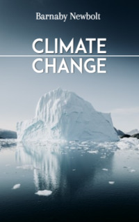

# Climate Change <kbd>v3.2.1</kbd>

  

## Creator
Barnaby Newbolt

## Description
Many scientists talk about climate change. They even predict the next end of the world. There are serious consequences for the planet. People are frightened. But how bad is it really? Mark Twain once said that a lot of people talk about the weather, but no one can say anything really important about. For the past hundred years, humanity has been talking about the changes in the weather. About storms, hurricanes, heat waves and floods. Each country has its own troubles. Who is to blame? Are these phenomena the consequences of technological progress? Or does nature change by itself? What can we do to improve this situation? The author of this book tries to give answers to all these questions. 
