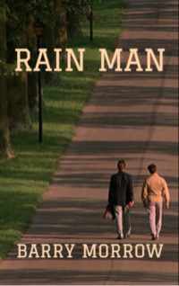

# Rain Man <kbd>v3.2.1</kbd>

  

## Creator
Barry Morrow

## Description
Charlie's father died. The son is sure that he will receive all his wealth in inheritance. His father is a millionaire and this money would change the life of a young businessman. But this does not happen. Charlie's brother receives the money. It is unexpected, as Charlie did not even know about the existence of his brother. It seems to Charlie unfair. Charlie's brother is not like other people. He has autism and lives in a hospital for the mentally ill. The young man decides to take his brother from the hospital and convince to give half the money to him. Charlie's brother is a brilliant mathematician. At the same time, he has the mind of a small child. He lives in his fictional world and is terrified of flying airplanes. As a result, the brothers make a car trip through the whole country.
