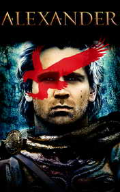

# Alexander the Great <kbd>v3.3.1</kbd>

  

## Creator
Beddall Fiona

## Description

Alexander the Great is the greatest conqueror of all time. His father was king Philip II and his mother was Olympias, the daughter of king Neoptolemus I of Epirus. When Alexander was 13, Aristotle became his tutor. The philosopher awakened the idea of greatness, power and intellectual rigor in his pupil. Aristotle taught him how to demonstrate the force moderately and consciously. Alexander treated his teacher with admiration and respect. He often said that he owed life to his father and a decent life to Aristotle. Achilles – the hero of the Trojan War was the ideal for Alexander. Alexander had no equal rivals in all competitions. When he was a boy, he tamed a wild horse named Bucephalus, who later served him in many battles.  

