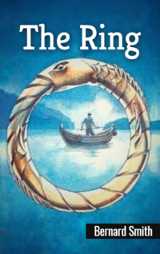

# The Ring <kbd>v3.2.1</kbd>

  

## Creator
Bernard Smith

## Description
The Doctor faces a difficult task. Now he has to solve a complex detective story that takes place in a small fishing village. The first problem is Rafael. He's a crazy man who lives in a boat shed on the beach. He was once a normal person, but then something terrible happened. How to find the cause of this insanity? The second mystery is the fate of the girl with whom Rafael was in love. At the same time, a wandering soldier arrives in the village with his mysterious history. Rafael knows the answers to all these questions, but the madman cannot tell anything. So what are the madman and the other villagers hiding? And why can the golden ring help to learn answers? The Doctor has to find everything out.   
