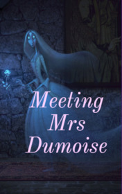

# Meeting Mrs Dumoise <kbd>v3.2.1</kbd>

  

## Creator
Bill Bowler

## Description
People, who know much about ghosts, can understand this story better, than somebody else. The main character lived for a long time in India and witnessed these events. Dumoise worked as a doctor in the north-west of India, in Punjab. Dumoise was a small, plump man and married a young woman, as round and unhurried as he himself was. For some time, the couple was happy. But their happiness was not to last long. A typhus epidemic began in the city. His wife also got sick. For several days, the doctor thought it was a normal fever and a lot of time was lost. The woman passed away. Dumoise returned to his usual life. The widower did not want to accept help from any friends. He thought that he would be able to cope with everything on his own.
