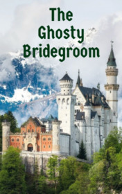

# The Ghosty Bridegroom <kbd>v3.3.1</kbd>

  

## Creator
Bill Bowler

## Description
Everything happened many years ago. In Odenwald, the south of Germany, the von Landshort Castle stood beside the river. The owner of this castle was a proud aristocrat. His father, a famous warrior, left him this castle. The Baron took care of his home as best as he could. Many other rich German families built comfortable modern houses in the valleys, abandoning traditional fortresses. The baron had another treasure - a very beautiful daughter. At the age of eighteen, she knew how to read, dance, play the guitar and sing beautiful love songs. Her skills were amazing. The girl never left the castle.The baron's daughter was raised by her aunts. They had always convinced her that she needed to be afraid of men and not to talk to them.
