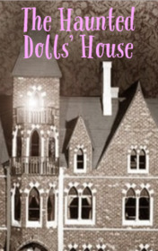

# The Haunted Dolls' House <kbd>v3.2.1</kbd>

  

## Creator
Bill Bowler

## Description
Mr. Dileth saw an amazing dollhouse in one store. He wanted to buy it. He knew a good  antique thing and understood that this house could be very old. Having bargained with the seller, he agreed on less than seventy-five pounds but more than fifty pounds. After this, the seller was relieved to tell his wife that somebody had finally bought the house. And Mr. Dilett was already examining this purchase in his own bedroom. The dollhouse was clearly made in the eighteenth century. It was large, wide, with four rooms and furniture. There were stained-glass windows, dolls and a clock with a bell inside. Mr. Dileth realized that it could be sold ten times more expensive. A wonderful deal! Still it turned out to be not so simple.
