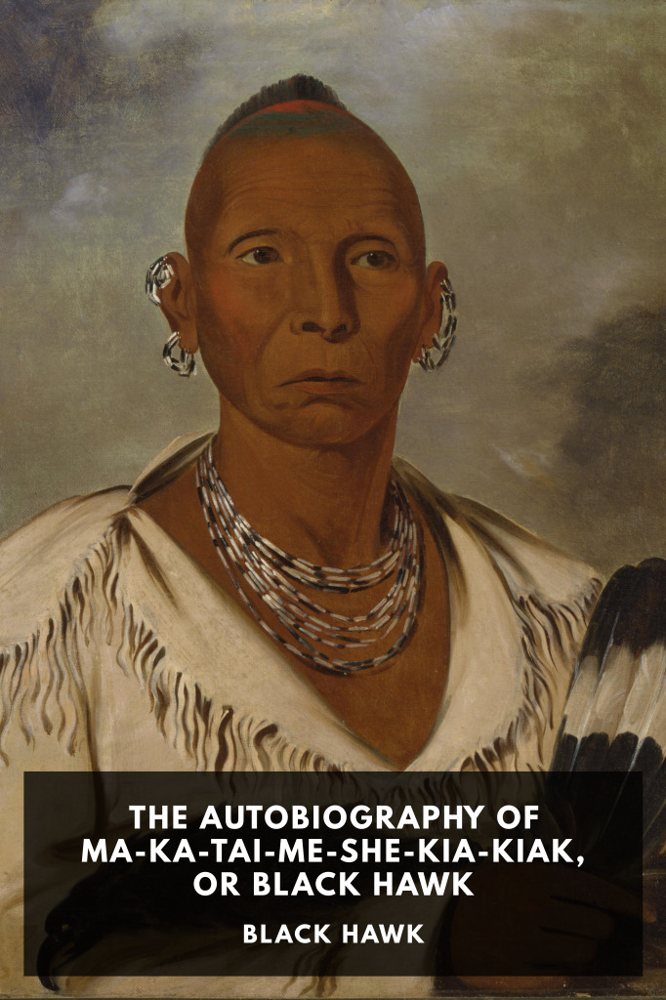

# The Autobiography of Ma-Ka-Tai-Me-She-Kia-Kiak, or Black Hawk <kbd>v3.3.1</kbd>

  

## Creator
Black Hawk

## Description
The autobiography of Black Hawk, the famous leader of the Native American Sauk tribe and central figure in the Black Hawk War of 1832.
