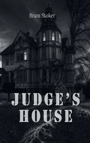

# The Judge's House <kbd>v3.3.1</kbd>

  

## Creator
Bram Stoker

## Description
This is a story from a world famous writer who wrote a book about the first vampire in the world. A young lawyer named John Moore comes to a small town to prepare for the exams in a relaxed atmosphere. After spending one night in a hotel, he firmly decides to rent a big beautiful mansion to live in it. The hostess of the hotel warns the young man that this mansion has a bad reputation. A cruel judge had lived there before. Nowadays some mysterious ghosts live in this house.  It is a bad idea to rent it. But John doesn't believe in ghosts, and the house seems very comfortable. The young man moves to a new place but it is not possible to live peacefully. Everything begins with a huge rat, that comes to him at night. And then the events start evolving rapidly.
