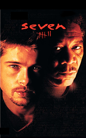

# Seven <kbd>v3.2.1</kbd>

  

## Creator
Bruno Anthony

## Description
The book is based on the famous American thriller with the main Hollywood stars in the lead roles. According to the story, two police detectives are investigating the case of the serial killer John Doe. The maniac considers himself as the instrument of God and consistently pushes people for seven deadly sins. The killer exposes his victims to fatal physical and mental suffering, which is prepared with a cold premeditation. Each expose is carefully planned. Each victim (as Doe thins) is the standard of that sin to be punished. The sophisticated tormentor and murderer leaves only ╨░ title of the sin and a clever puzzling clue at the crime scene, allowing to find the next 'sinner'. John Doe thinks his activity is a sermon aimed to teach the citizens a good lesson.
