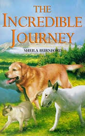

# The Incredible Journey <kbd>v3.3.1</kbd>

  

## Creator
Burnford Sheila

## Description
Not only people can be fearless before setting off on a great adventure. A cat and two dogs find the right time to run away from their new owner's house. A long journey of hundreds kilometers through the Canadian woods is waiting for them. They will meet many wild animals on their way. They will meet friendly and not very friendly people with their pets. The runners will get into various kinds of troubles and barely manage to escape unhurt. Even though the animals get some help, nobody knows, what is to happen to our helpless heroes. Still neither hunger nor exhaustion can stop them. Only these two dogs and the cat know where they are heading. One definite purpose is leading them. What should their owners expect, just coming home to an empty house from England?
