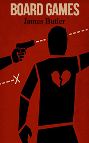

# Board Games <kbd>v3.2.1</kbd>

  

## Creator
Butler James

## Description
Arthur Mowbray is a head of a huge company. He created his company after he had invented a board game тАЬMowbray's KillerтАЭ. The game was made of cardboard and Plasticine figures. One day something terrible happened. His body was found in the dining room of his country house. Inspector Ainsworth started investigating this case. He has no evidence and no witnesses. But there are many suggestions. Ainsworth suspects that one of the directors can be guilty. He has to dive into the world of a fierce competition between the employees to learn the real truth and to find the killer. Will he be able to remain unharmed at the end? And the company is not so great it appears to be at first glance. Let's see what a single inspector can do against the entire corporation.
