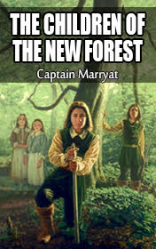

# The Children of the New Forest <kbd>v3.3.1</kbd>

  

## Creator
Captain Marryat

## Description
Captain Frederick Marryat was an English writer well known for his adventure novels. He wrote 'The Children of the New Forest', one of the first historical books for children. The story takes us to the England of 1647. Cromwell's soldiers have sent the King to prison and everybody who takes his side becomes their enemy. Colonel Beverley was a brave man and died fighting for the King. Now his house is burnt and his four children are in danger. Luckily, they manage to escape to the New Forest, where they live with their father's old friend Jacob. The children have to forget about their noble origin and learn to run the household. They live a quiet but poor life and secretly dream not only to survive, but also to restore justice.
