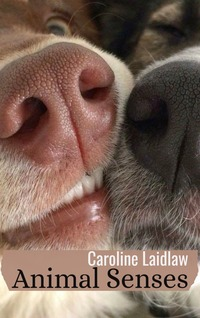

# Animal Senses <kbd>v3.2.1</kbd>

  

## Creator
Caroline Laidlaw

## Description
Have you ever thought of whether animals are different from each other? Indeed, they are different in many aspects. Still they have much in common. Each animal has eyes, a mouth and a nose. But further one can observe serious differences.All these things are due to evolution. A giraffe is a great example. Over the centuries, it has changed very much. Now its long neck allows it to eat fresh leaves from tall trees. Its unusual teeth help to pluck leaves from branches as quickly and easily as possible. Chimpanzees can communicate with each other using facial expressions. Dogs and rabbits have a very developed sense of smell. They can communicate using a variety of smells. Each species possesses such skills that were the most necessary in the process of evolution. Learn more by reading this book.   
