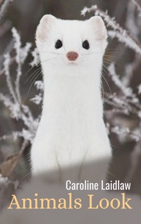

# Animals Look! <kbd>v3.2.1</kbd>

  

## Creator
Caroline Laidlaw

## Description
You can find many species of animals on our planet. They all look different. Eyes of different shapes and colors, different ears. Many animals have an interesting position of their eyes. Foxes have eyes in front of heads. Some species of crocodiles have eyes on the tops of their heads. What is the reason for this diversity? With ears, everything is no less difficult. Foxes and cats can boast with large moving and directed forward ears. When you look at eagles and crocodiles, you will not see their ears at all. But of course, they exist. The answers to all questions lie in evolution. All kinds of animals slowly change over thousands of years of their existence. The world is changing rapidly. So only those who are able to adapt to new conditions survive. Learn more about evolution in this book. 
