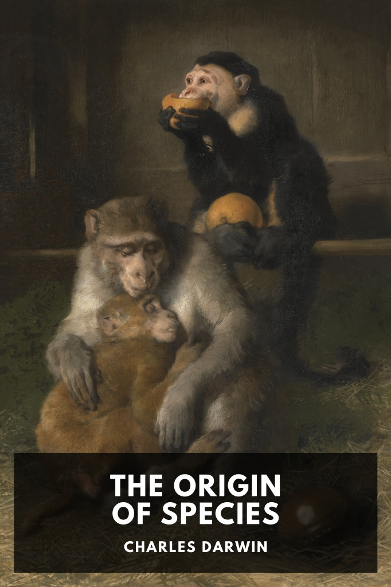

# The Origin of Species <kbd>v3.3.1</kbd>

  

## Creator
Charles Darwin

## Description
A distinguished amateur scientist lays out the evidence for the origin of species by means of natural selection.
